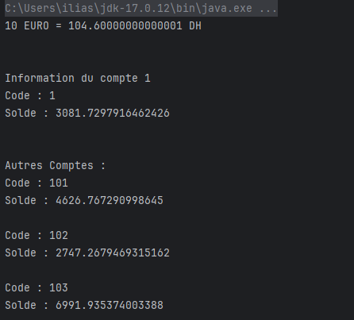

<h2>Compte rendu</h2>

<h3>WSDL du webservice :</h3>

 

 

<h3>Tests des requêtes SOAP</h3>

<h5>Test convert() method passes</h5>

<h5>Test convert() method fails</h5>

<h5>Test getCompte() method</h5>

<h5>Test getComptes() method</h5>

 

 

<h3>Consomer le webservice depuis un client java</h3>
